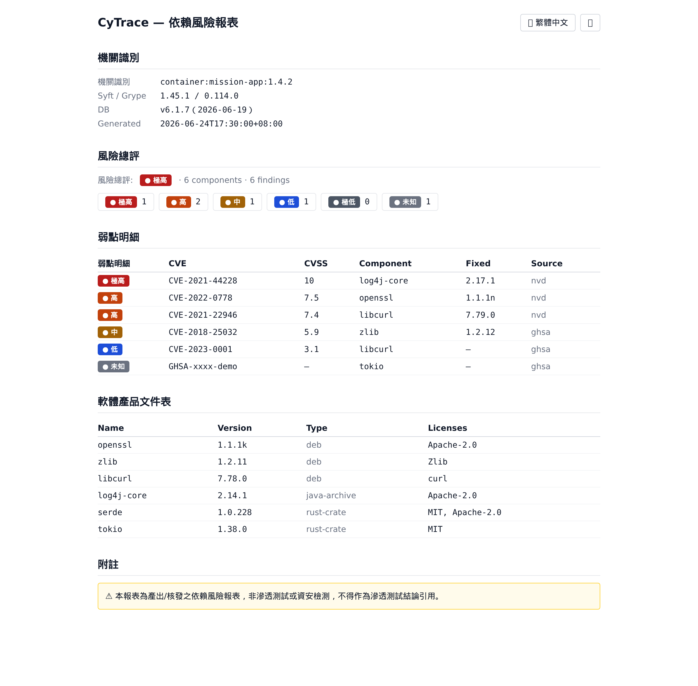

# CyTrace

> 地端、無網際網路（軍用網路）場域的**軟體依賴風險報表產生器**。
> Air-gapped software dependency risk report generator for on-premise / military networks.

CyTrace 封裝 **Syft**（產 SBOM）與 **Grype**（比對 CVE）兩個 Apache-2.0 工具，
一鍵對目標（原始碼目錄／容器映像／檔案系統）產出可併入交件的**依賴風險報表**與
**軟體產品文件表（SBOM）**。產品形態是**單一靜態 binary ＋ 離線單檔 HTML 報表**——無伺服器、零外連、跑完即結束。

## 報表範例



> 自包含**離線單檔 HTML**：零外部請求、可攜、雙擊用瀏覽器開啟。內含五區塊——機關識別／風險總評／弱點明細／軟體產品文件表（SBOM）／附註免責。可在瀏覽器內 🌐 切換中／英、切換深色主題、點嚴重度徽章篩選。

## 設計原則

- **零外連（air-gapped）**：執行期、報表、CI 一律不連網；漏洞比對用離線 grype DB 快照。
- **穩定優先**：Rust 單一 musl 靜態 binary、零 runtime 依賴、釘選版本、可重現建置、golden baseline 回歸測試。
- **可稽核交付**：交付物可 `sha256` + 簽章驗證；報表標註工具與 DB 版本/日期；附自產 SBOM。
- **雙語 i18n**：強制 `zh-TW`（fallback）與 `en-US`，禁止硬編碼。
- **供應鏈純淨**：僅 Apache-2.0 第三方（Syft/Grype），明確禁用中國來源依賴。

## 下載

預編譯執行檔見 [GitHub Releases](https://github.com/astroicers/CyTrace/releases)（雙平台，ADR-010）：

| 平台 | 檔案 | 說明 |
|------|------|------|
| Windows x86_64 | `cytrace-x86_64-windows.exe` | msvc 靜態 CRT，免 VC++ 可轉散發套件 |
| Linux x86_64 | `cytrace-x86_64-linux` | musl 靜態，零 runtime 依賴 |

每次發布附 `SHA256SUMS`（`sha256sum -c SHA256SUMS` 驗完整性）。掃描另需 syft/grype 引擎與 grype DB 快照（見下方／[docs/DELIVERY_SOP.md](docs/DELIVERY_SOP.md)）。

## 快速開始

```bash
# 1) 安裝引擎（一次；有網段）
curl -sSfL https://raw.githubusercontent.com/anchore/syft/main/install.sh  | sh -s -- -b ~/.local/bin
curl -sSfL https://raw.githubusercontent.com/anchore/grype/main/install.sh | sh -s -- -b ~/.local/bin
export PATH="$HOME/.local/bin:$PATH"
grype db update                       # 取漏洞庫（線上一次）

# 2) build
cargo build --release

# 3) 一鍵掃描 → 出報表（達 high 以上以退出碼 2 結束，供 CI）
./target/release/cytrace run dir:/path/to/project --fail-on high -o report.html
```

**地端離線交付**：`make package` 在 build 機產出單一安裝包（cytrace + 釘選引擎 + grype DB 快照 + 自產 SBOM + SHA256SUMS + 離線 wrapper），攜入斷網目標機後 `./cytrace-offline run dir:/path`。詳見 [docs/DELIVERY_SOP.md](docs/DELIVERY_SOP.md)。

## 子命令

| 指令 | 作用 |
|------|------|
| `cytrace run <目標> [--fail-on 等級] [-o 檔]` | 一鍵：產 SBOM → 比對 → 出報表 |
| `cytrace scan <目標> [-o 目錄]` | 只產 `sbom.cdx.json` 與 `grype.json` |
| `cytrace report <json> [-o 檔]` | 由既有 ScanResult JSON 離線重現報表（稽核複核） |
| `cytrace batch <t1> <t2> …` | 多目標批次掃描 |

- **目標格式**：`dir:/路徑`、`映像:標籤`（容器）、檔案系統
- **語言**：`--lang zh-TW｜en-US`
- **退出碼**：`0` 正常／`2` 達 `--fail-on` 門檻／`1` 錯誤

## 嚴重度尺度

| zh-TW | en-US | `--fail-on` 值 |
|---|---|---|
| 極高 | Critical | `critical` |
| 高 | High | `high` |
| 中 | Medium | `medium` |
| 低 | Low | `low` |
| 極低 | Negligible | `negligible` |
| 未知 | Unknown | `unknown` |

風險總評＝出現的最高等級。色彩非唯一資訊載體（另以文字標籤呈現，色盲友善）。

## 輸出格式

產品輸出的是**離線單檔 HTML**（自包含、可攜、瀏覽器離線開啟），**非 PDF**。
需要 PDF 時可用瀏覽器列印另存（`Ctrl+P`）；產品內建 PDF 為後續評估項（見 ADR-005）。

## 架構（概要）

**Rust CLI 核心**（Cargo workspace 4 crates：`cytrace-types`／`-core`／`-report`／`-cli`；呼叫 Syft+Grype 子程序、serde 解析、嚴重度分級、`--fail-on`）
＋ **visual-web-stack DOM 子集前端**（React/Vite/Tailwind/Radix/react-i18next，build 成單檔內聯，由核心 `include_str!` 內嵌進 binary）。

```
cytrace run <目標> → Syft(SBOM) → Grype(離線DB,CVE) → 解析/分級 → 內嵌前端 → 單檔 HTML 報表 + SBOM
```

## 文件

| 文件 | 說明 |
|------|------|
| [docs/SRS.md](docs/SRS.md) | 軟體需求規格（FR / NFR） |
| [docs/SDS.md](docs/SDS.md) | 軟體設計規格（Cargo workspace、子程序編排、資料模型） |
| [docs/UIUX_SPEC.md](docs/UIUX_SPEC.md) | 報表檢視器 UI/UX（雙語、嚴重度色票、a11y） |
| [docs/DELIVERY_SOP.md](docs/DELIVERY_SOP.md) | 離線交付與 DB 更新／簽章 SOP |
| [docs/adr/](docs/adr/) | 架構決策紀錄 ADR-001 ～ ADR-010 |
| [ROADMAP.yaml](ROADMAP.yaml) | Autopilot 任務清單（唯一 live 狀態權威） |

## 開發治理（ASP）

本專案以 [AI-SOP-Protocol](https://github.com/astroicers/AI-SOP-Protocol) 治理（level: standard、autopilot enabled）。

- ADR 經人類審核升 `Accepted` 後，`/asp-autopilot` 解鎖對應里程碑實作。
- 常用：`make test`／`make lint`（fmt+clippy+i18n）／`make autopilot-validate`／`make audit-health`／`make help`。

## 狀態

✅ **M0–M5 實作完成**（治理骨架 + Rust 核心 + 掃描管線 + 雙語離線報表 + 離線封裝 + CI）。
🟡 待後續：M4 簽章執行（操作端受管金鑰）、M6 SaaS 監管（範圍外、延後）。

## 授權

本專案程式碼 Apache-2.0。封裝之 Syft／Grype 亦為 Apache-2.0（見交付 NOTICE）。
