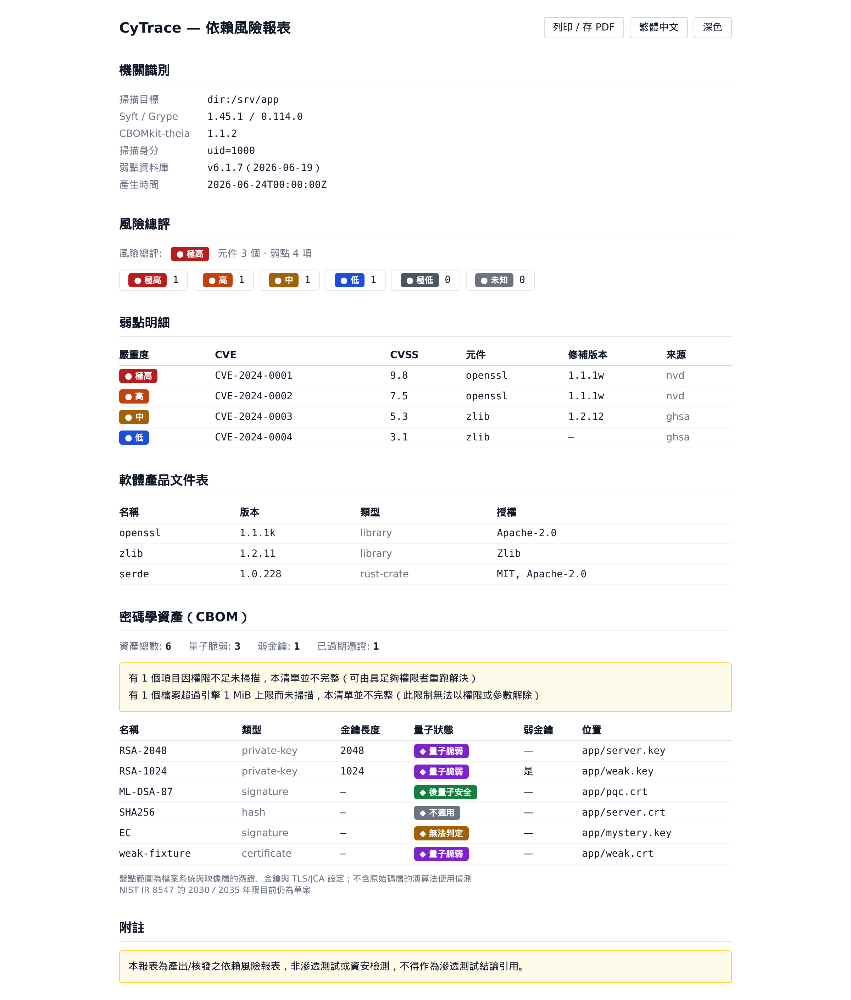

# CyTrace

> 地端、無網際網路（軍用網路）場域的**軟體依賴風險報表產生器**。
> Air-gapped software dependency risk report generator for on-premise / military networks.

CyTrace 封裝 **Syft**（產 SBOM）、**Grype**（比對 CVE）與 **CBOMkit-theia**（密碼學資產盤點）三個 Apache-2.0 工具，
對目標（原始碼目錄／容器映像／檔案系統）產出可併入交件的**依賴風險報表**、**軟體產品文件表（SBOM）**，
以及選用的**密碼學資產清單（CBOM）與量子脆弱判定**。

兩種用法，共用同一條掃描管線、零外連：

- **命令列**：單一靜態 binary，跑完即產出**離線單檔 HTML 報表**；可接 CI（退出碼閘門）。
- **Web 服務模式**（`cytrace serve`）：場域內集中掃描伺服器，瀏覽器登入控制台送掃描、看報表；以容器交付。

目前版本：**v0.6.0**（變更見 [CHANGELOG.md](CHANGELOG.md)）。

## 報表範例



> 自包含**離線單檔 HTML**：零外部請求、可攜、雙擊用瀏覽器開啟。內含六區塊——機關識別／風險總評／弱點明細／
> 軟體產品文件表（SBOM）／密碼學資產（`--cbom` 時）／附註與免責。可在瀏覽器內切換中／英、切換深色主題、
> 點嚴重度徽章篩選、一鍵列印或另存 PDF。

## 設計原則

- **零外連（air-gapped）**：執行期、報表、CI 一律不連網；漏洞比對用離線 grype DB 快照。
- **穩定優先**：Rust 靜態 binary、零 runtime 依賴、釘選版本（`scripts/versions.env`）、可重現建置、golden baseline 回歸測試。
- **可稽核交付**：交付物可 `sha256` + 簽章驗證；報表標註工具版本、DB 快照版本／日期與掃描身分；附自產 SBOM。
- **雙語 i18n**：`zh-TW`（fallback）與 `en-US`，報表、控制台、終端訊息與 `--help` 皆雙語，禁止硬編碼。
- **供應鏈純淨**：第三方工具本體皆 Apache-2.0（Syft／Grype／CBOMkit-theia），明確禁用中國來源依賴（專案／組織層級）；
  CI 檢查授權、來源白名單與安全通報（cargo-deny）。

## 下載

預編譯檔見 [GitHub Releases](https://github.com/astroicers/CyTrace/releases)：

| 檔案 | 說明 |
|------|------|
| `cytrace-x86_64-linux` | Linux x86_64，musl 靜態 binary，零 runtime 依賴 |
| `cytrace-x86_64-windows.exe` | Windows x86_64，msvc 靜態 CRT，免 VC++ 可轉散發套件 |
| `cbomkit-theia-windows-amd64.exe` | CBOM 引擎 Windows 版（自源碼交叉編譯），供組 Windows 安裝包 |
| `SHA256SUMS` | 上列執行檔的校驗（`sha256sum -c SHA256SUMS`） |
| `cytrace-vX.Y.Z-image.tar`、`SHA256SUMS-image`、`IMAGE_DIGEST.txt` | 容器映像離線包與其校驗、digest |

掃描另需 Syft／Grype 引擎與 grype DB 快照；`--cbom` 另需 CBOMkit-theia。場域交付請用離線安裝包或容器（見下方）。

以 minisign 簽章（`SHA256SUMS.minisig`）的有兩處：自 v0.5.0 起，本 Release 的 `SHA256SUMS`（上列執行檔）由交付工作站於發布後簽章附上；離線安裝包的 `SHA256SUMS` 則在交付端打包時簽（DELIVERY_SOP §3）。兩者用同一把交付公鑰（金鑰 ID `055ACC6F1822B10E`，即 `keys/cytrace.pub`）：

```
RWQOsSIYb8xaBZvkvmUpX/X8RzYFHPVNujqCGCsg53ytFOc+btCvTlFX
```

驗章：`minisign -Vm SHA256SUMS -P <公鑰字串>`。場域請以交付驗收單上帶外抄錄的字串驗章（DELIVERY_SOP §3）。

## 快速開始（開發機）

```bash
# 1) 安裝釘選版引擎（一次；有網段）——版本必須等於 scripts/versions.env，
#    其他版本可能輸出 grype 讀不懂的格式（如 syft 1.51 預設 CycloneDX 1.7）
curl -sSfL https://raw.githubusercontent.com/anchore/syft/main/install.sh  | sh -s -- -b ~/.local/bin v1.45.1
curl -sSfL https://raw.githubusercontent.com/anchore/grype/main/install.sh | sh -s -- -b ~/.local/bin v0.114.0
export PATH="$HOME/.local/bin:$PATH"
grype db update                       # 取漏洞庫（線上一次）
scripts/build-theia.sh                # 選用：--cbom 用的 CBOM 引擎（自源碼建置，需 Docker）

# 2) build
cargo build --release

# 3) 一鍵掃描 → 出報表（達 high 以上以退出碼 2 結束，供 CI）
./target/release/cytrace run dir:/path/to/project --fail-on high -o report.html
./target/release/cytrace run dir:/path/to/project --cbom -o report.html   # 併同盤點密碼學資產
```

**地端離線交付**：`make package`（Linux）或 `pwsh scripts/package.ps1`（Windows）在 build 機產出單一安裝包——
cytrace ＋ 釘選引擎（含 CBOM 引擎）＋ grype DB 快照 ＋ 自產 SBOM ＋ NOTICE ＋ SHA256SUMS ＋ 離線 wrapper；
攜入斷網目標機後 `./cytrace-offline run dir:/path`（Windows：`.\cytrace-offline.ps1 run dir:C:\path`）。
詳見 [docs/DELIVERY_SOP.md](docs/DELIVERY_SOP.md)。

## 子命令

| 指令 | 作用 |
|------|------|
| `cytrace run <目標> [--fail-on 等級] [-o 檔] [--cbom] [--fail-on-quantum-vulnerable]` | 一鍵：產 SBOM → 比對弱點 → 出報表 |
| `cytrace batch <目標…> [--fail-on 等級] [-o 目錄] [--cbom] [--fail-on-quantum-vulnerable]` | 多目標批次掃描，逐一出報表 |
| `cytrace scan <目標> [-o 目錄] [--cbom] [--spdx]` | 只產 `sbom.cdx.json` 與 `grype.json`（`--spdx` 另產 SPDX 2.3 的 `sbom.spdx.json`、`--cbom` 另產 `cbom.cdx.json`） |
| `cytrace report <json> [-o 檔]` | 由既有 ScanResult JSON 離線重建報表（稽核複核） |
| `cytrace serve [--bind] [--data-dir] [--tls-cert --tls-key]` | Web 服務模式：登入控制台 + 掃描／報表 API（ADR-011） |
| `cytrace hash-password` | 離線產生管理密碼的 argon2id hash（需互動式終端機） |
| `cytrace health [--bind]` | 服務存活檢查（容器 HEALTHCHECK 用） |

- **目標格式**：`dir:/路徑`、容器映像（`docker-archive:映像.tar` 等 Syft 支援的形式）、檔案系統。
  `--cbom` 只接受**本地**目錄、docker-save tar 或 OCI layout，不接受 registry 參照（避免外連）。
- **語言**：`--lang zh-TW｜en-US`（全域旗標，可放在子命令後）；未給時讀環境變數 `CYTRACE_LANG`，皆無則 zh-TW。
  執行訊息、錯誤訊息、`--help` 與參數用法錯誤皆依此語言。報表內可再切換語言。
- **`--help`**：`cytrace --help`、`cytrace <子命令> --help`。

### 退出碼

| 碼 | 意義 |
|---|---|
| `0` | 正常（含 `--help`、`--version`） |
| `2` | 達 `--fail-on` 門檻，或 `--fail-on-quantum-vulnerable` 發現量子脆弱資產 |
| `1` | 錯誤：含參數打錯、引擎失敗、讀寫失敗；`--fail-on-quantum-vulnerable` 未取得完整 CBOM 結果（fail-closed） |

同時成立時 `1` 優先於 `2`——「沒掃完整」不會被當成「掃到了弱點」。

### 容器（Web 服務模式）

```bash
# 產管理密碼 hash，起站，瀏覽器登入操作
docker run --rm -it ghcr.io/astroicers/cytrace:latest hash-password
docker run -d --read-only --tmpfs /tmp -p 8443:8443 \
  -v ./data:/data -v ./db:/db:ro \
  -e CYTRACE_ADMIN_PASSWORD_HASH='<hash>' \
  ghcr.io/astroicers/cytrace:latest
```
映像內含三個引擎（不含 grype DB，以 `/db` 掛入）；`docker stop` 會優雅關閉。
詳見 [docs/DOCKER.md](docs/DOCKER.md)；離線搬運見 [docs/DELIVERY_SOP.md](docs/DELIVERY_SOP.md) §7。

## 嚴重度尺度

| zh-TW | en-US | `--fail-on` 值 |
|---|---|---|
| 極高 | Critical | `critical` |
| 高 | High | `high` |
| 中 | Medium | `medium` |
| 低 | Low | `low` |
| 極低 | Negligible | `negligible` |
| 未知 | Unknown | `unknown` |

風險總評＝出現的最高等級。`--fail-on` 的值不分大小寫，打錯即以退出碼 `1` 結束。
色彩非唯一資訊載體（另以文字標籤呈現，色盲友善）。

## 密碼學資產盤點（CBOM，選用）

`--cbom`（或控制台的勾選項）以 CBOMkit-theia 盤點檔案系統／映像層的憑證、金鑰、演算法與 TLS／JCA 設定，
輸出 CycloneDX CBOM（`cbom.cdx.json`），報表另列「密碼學資產」區段：量子脆弱判定、弱金鑰、憑證到期。

- 範圍限於檔案系統／映像層，**不含**原始碼層的演算法辨識。
- 報表只記資產的型別、長度、位置等中繼資料，**不含金鑰內容**。
- 權限不足、超過引擎 1 MiB 門檻、引擎偵測到但未建模的項目，分三類計數揭露，不靜默略過。
- 設計與限制見 [ADR-013](docs/adr/ADR-013-cbom-crypto-inventory.md)。

## 輸出格式

產品輸出的是**離線單檔 HTML**（自包含、可攜、瀏覽器離線開啟），**非 PDF**。
需要 PDF 時用報表上的「列印／存 PDF」按鈕或瀏覽器列印另存（ADR-005）。
另可產出原始 `sbom.cdx.json`、`grype.json`、`cbom.cdx.json`，以及可供 `cytrace report` 重建報表的 ScanResult JSON。

## 架構（概要）

**Rust 核心**（Cargo workspace 6 crates：`cytrace-types`／`-core`／`-i18n`／`-report`／`-server`／`-cli`）：
子程序呼叫 Syft＋Grype＋CBOMkit-theia、解析、嚴重度與量子脆弱分級、閘門判定、Web 服務。
**前端**（React／Vite／Tailwind／Radix／react-i18next）建置成兩份產物並內嵌進 binary：
報表樣板（單檔內聯，`include_str!`）與 Web 控制台（`rust-embed`）。

```
cytrace run <目標> ─→ Syft(SBOM) ─→ Grype(離線DB, CVE) ─┐
        └─ --cbom → CBOMkit-theia(憑證/金鑰/演算法) ─────┤→ 解析/分級(嚴重度＋量子脆弱)
                                                          → 內嵌前端 → 單檔 HTML 報表 + SBOM(+CBOM)
cytrace serve ─→ 登入控制台 ─→ job 佇列 ─→ 同一條掃描管線 ─→ 報表／產物下載
```

## 文件

| 文件 | 說明 |
|------|------|
| [CHANGELOG.md](CHANGELOG.md) | 版本變更（隨交付包散布，離線場域唯一來源） |
| [docs/SRS.md](docs/SRS.md) | 軟體需求規格（FR／NFR） |
| [docs/SDS.md](docs/SDS.md) | 軟體設計規格（crate 切分、子程序編排、資料模型、錯誤與 i18n、Web 服務） |
| [docs/UIUX_SPEC.md](docs/UIUX_SPEC.md) | 報表與控制台 UI/UX（雙語、嚴重度色票、a11y） |
| [docs/DELIVERY_SOP.md](docs/DELIVERY_SOP.md) | 離線交付、簽章、DB 更新、容器搬運 SOP |
| [docs/DOCKER.md](docs/DOCKER.md) | 容器部署（環境變數、TLS、healthcheck、停止） |
| [docs/adr/](docs/adr/) | 架構決策紀錄 ADR-001 ～ ADR-013 |
| [ROADMAP.yaml](ROADMAP.yaml) | 任務清單（唯一 live 狀態權威） |

## 開發

```bash
make lint               # fmt + clippy + i18n + NOTICE 對帳 + 前端檢查
make test               # 全部 Rust 測試（含 golden、CLI 端到端、i18n 機械閘）
make test-real-engine   # 真引擎整合測試（需 cbomkit-theia 在 PATH）
make frontend frontend-console   # 重建內嵌的報表樣板與控制台（改了 locales 或 frontend/src 就要跑）
```

本專案以 [AI-SOP-Protocol](https://github.com/astroicers/AI-SOP-Protocol) 治理：ADR 經人類審核升 `Accepted` 後才實作。

## 狀態

- ✅ M0–M5、M7–M9 完成：掃描管線、雙語離線報表、離線封裝與簽章交付、批次與 CI、雙平台發布、
  Web 控制台與容器交付、CBOM 盤點。自 v0.5.0 起 Release 的 `SHA256SUMS` 附 minisign 簽章。
- ⏸ M6 SaaS 監管：範圍外、延後。
- ⚠ 已知限制見 CHANGELOG 各版「已知限制」段。

## 授權

本專案程式碼 Apache-2.0。封裝之 Syft／Grype／CBOMkit-theia 本體亦為 Apache-2.0；theia 相依另含 MIT 與 MPL-2.0 成分（見交付 NOTICE）。
